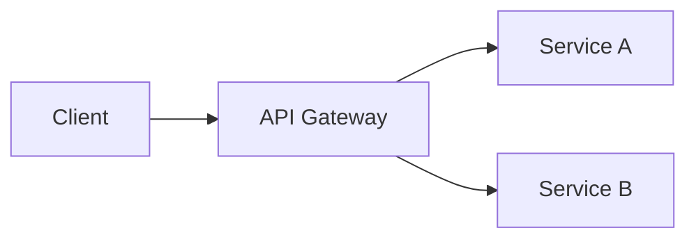

# Markdown Formatting Standards

All generated markdown documents must follow these formatting conventions.

## JIRA Ticket References

Always reference JIRA tickets as hyperlinks, never as plain text:

✅ Correct:
- `[CLOUDP-148512](https://jira.mongodb.org/browse/CLOUDP-148512)`
- `[SPM-4258](https://jira.mongodb.org/browse/SPM-4258)`

❌ Incorrect:
- `CLOUDP-148512`
- `ticket CLOUDP-148512`
- `See CLOUDP-148512 for details`

When encountering ticket references in the format `PROJECT-NUMBER`, convert them to:

```markdown
[TICKET-NUMBER](https://jira.mongodb.org/browse/TICKET-NUMBER)
```

## Date Formatting

Always use ISO 8601 format for dates:

✅ Correct: `2026-01-20`
❌ Incorrect: `01/20/2026`, `January 20, 2026`, `20 Jan 2026`

This ensures chronological sorting and unambiguous interpretation.

## Status Indicators

Use consistent emoji for status indicators:

| Status | Emoji | Usage |
|--------|-------|-------|
| Complete | ✅ | Task done, requirement met |
| Failed/Blocked | ❌ | Task failed, requirement not met |
| Warning/Attention | ⚠️ | Needs review, partial completion |
| In Progress | 🔄 | Currently being worked on |

## Code Blocks

Always specify the language for syntax highlighting:

✅ Correct:
~~~markdown
```bash
jj status
```
~~~

❌ Incorrect:
~~~markdown
```
jj status
```
~~~

Common language identifiers: `bash`, `nix`, `python`, `javascript`, `typescript`, `go`, `java`, `json`, `yaml`, `markdown`, `sql`

## Links

### External Links

Use descriptive link text, not bare URLs:

✅ Correct: `[MongoDB Documentation](https://www.mongodb.com/docs/)`
❌ Incorrect: `https://www.mongodb.com/docs/`

### Internal Document References

Use relative paths for cross-references within a project:

✅ Correct: `See [research findings](./research/authentication.md)`

## Headings

- Start documents with a single H1 (`#`) for the title
- Use H2 (`##`) for major sections
- Do not skip heading levels (e.g., don't go from H2 to H4)
- Use sentence case for headings (capitalize first word only)

## Lists

- Use `-` for unordered lists (not `*`)
- Use `1.` for ordered lists (let markdown auto-number)
- Add blank lines between list items that contain multiple paragraphs or nested content

## Tables

- Always include a blank line before a table
- Tables must start on their own line (not inline with other content)
- Always include a header row with column alignment
- Use consistent column alignment (`:---` left, `:---:` center, `---:` right)
- Keep tables simple; for complex data, consider nested lists or separate sections

```markdown
| Column 1 | Column 2 | Column 3 |
|:---------|:--------:|---------:|
| Left     | Center   | Right    |
```

## Diagrams

Use Mermaid.js for diagrams.

### Example

~~~markdown

~~~

### Mermaid diagram types

Use appropriate diagram types for the content:

| Type | Use Case |
|:-----|:---------|
| `flowchart` | Process flows, system architecture, decision trees |
| `sequenceDiagram` | API calls, service interactions, message flows |
| `classDiagram` | Data models, class relationships |
| `erDiagram` | Database schemas, entity relationships |
| `gantt` | Project timelines, schedules |
| `stateDiagram-v2` | State machines, lifecycle diagrams |

## Whitespace

- One blank line before headings (except at document start)
- One blank line after code blocks
- One blank line between sections
- No trailing whitespace on lines
- Single blank line at end of file

## File Naming

- Use lowercase with hyphens: `my-document.md` not `MyDocument.md` or `my_document.md`
- Be descriptive but concise: `authentication-research.md` not `auth.md` or `research-on-authentication-patterns-and-best-practices.md`
- Use date prefixes for session logs: `2026-01-20-session.md`

## Document Structure

Standard document sections (when applicable):

1. **Title** (H1) - Clear, descriptive title
2. **Metadata** - Date, status, author, related items
3. **Summary/Overview** - Brief description (2-3 sentences)
4. **Main Content** - Organized with H2 sections
5. **Next Steps/Open Questions** - Action items or unresolved issues
6. **References** - Links to related documents, tickets, or external resources

